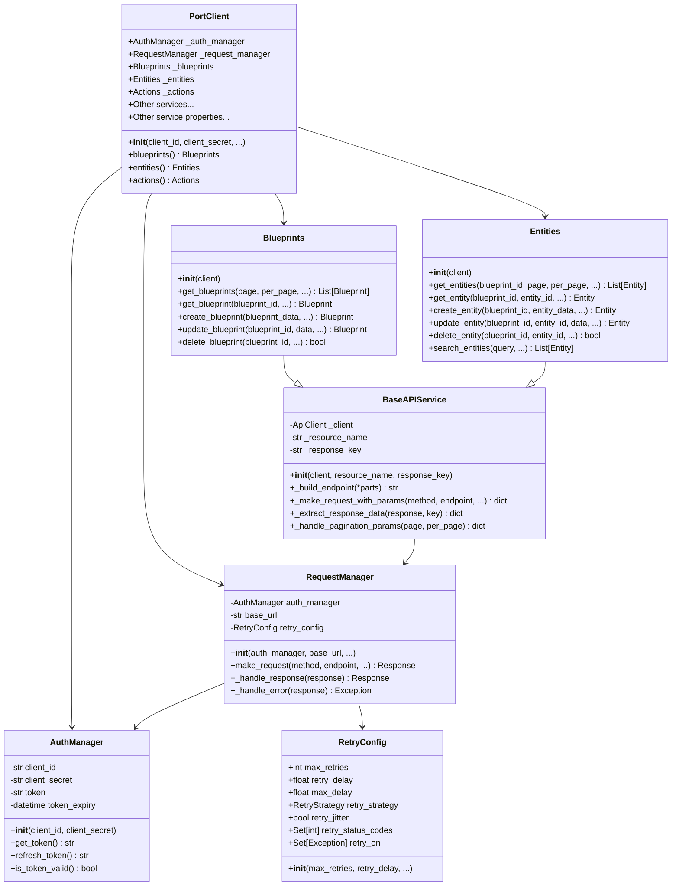

# Class Diagram

This class diagram shows the main classes in the PyPort library and their relationships:

- **PortClient**: The main client class that provides access to all API services.
- **AuthManager**: Handles authentication and token management.
- **RequestManager**: Manages HTTP requests and responses.
- **BaseAPIService**: Base class for all API services, providing common functionality.
- **Blueprints**: Service class for blueprint-related operations.
- **Entities**: Service class for entity-related operations.
- **RetryConfig**: Configuration for retry behavior.

The diagram shows inheritance relationships (Blueprints and Entities inherit from BaseAPIService) and composition relationships (PortClient contains AuthManager, RequestManager, and service classes).
