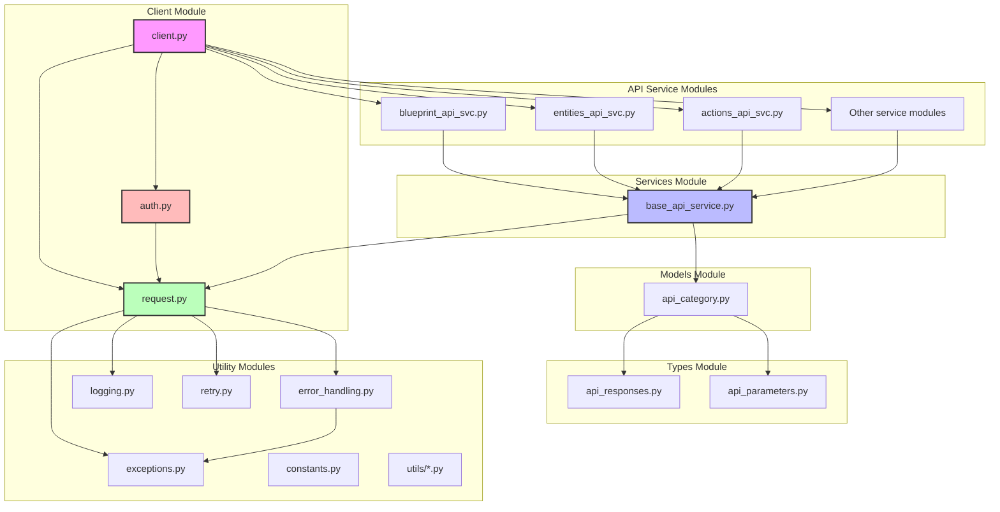

# Component Diagram

This component diagram shows the organization of the PyPort library into modules and their dependencies:

- **Client Module**: Contains the main client class, authentication manager, and request manager.
- **Services Module**: Contains the base service class that provides common functionality for all API services.
- **API Service Modules**: Contains individual service classes for different parts of the API.
- **Models Module**: Contains the base resource model for API resources.
- **Types Module**: Contains type definitions for API responses and parameters.
- **Utility Modules**: Contains utility functions and classes for error handling, logging, retry logic, etc.

The arrows indicate dependencies between components. For example, the client module depends on the authentication manager and request manager, and the API service modules depend on the base service class.
