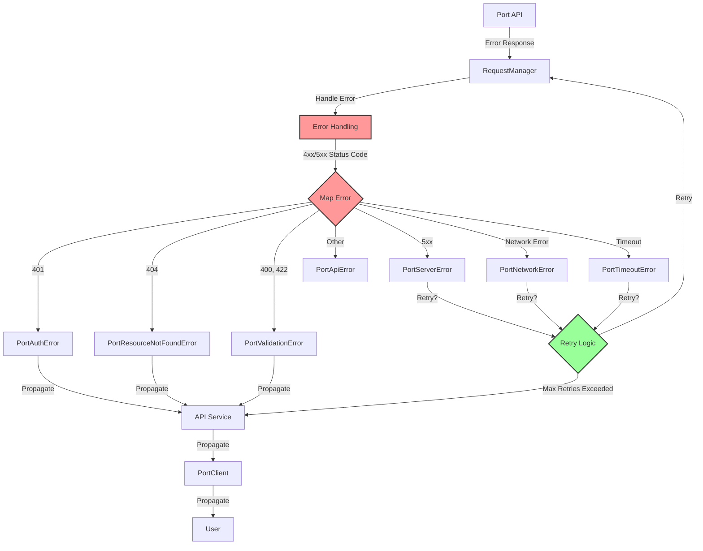

# Error Handling Diagram

This diagram illustrates the error handling flow in the PyPort library:

1. When the Port API returns an error response, the RequestManager passes it to the error handling component.
2. The error handling component maps the HTTP status code to an appropriate exception type:
   - 401: PortAuthError (authentication error)
   - 404: PortResourceNotFoundError (resource not found)
   - 400, 422: PortValidationError (validation error)
   - 5xx: PortServerError (server error)
   - Network errors: PortNetworkError
   - Timeouts: PortTimeoutError
   - Other errors: PortApiError (base class)
3. For certain types of errors (server errors, network errors, timeouts), the retry logic determines whether to retry the request.
4. If the maximum number of retries is exceeded, or if the error is not retryable, the exception is propagated up the call stack to the user.

This approach provides a consistent and robust error handling mechanism that helps users understand and handle errors from the Port API.
