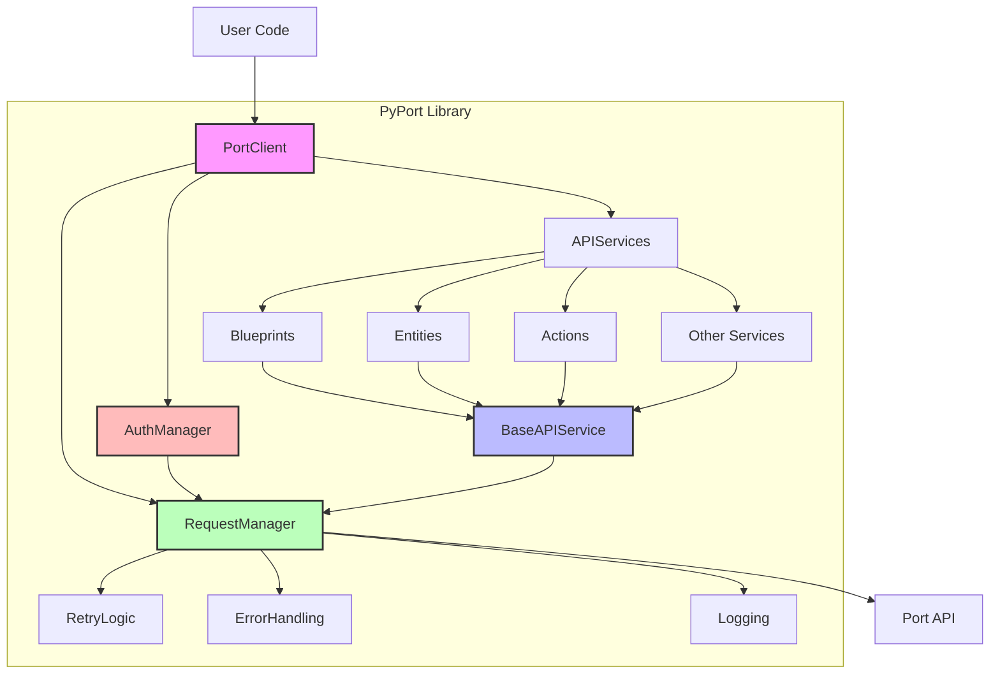

# High-Level Architecture Diagram

This diagram shows the high-level architecture of the PyPort library. The main components are:

- **PortClient**: The main entry point for the library, providing access to all API services.
- **AuthManager**: Handles authentication and token management.
- **RequestManager**: Manages HTTP requests and responses.
- **BaseAPIService**: Base class for all API services, providing common functionality.
- **API Services**: Individual service classes for different parts of the API (Blueprints, Entities, Actions, etc.).
- **RetryLogic**: Handles retrying failed requests.
- **ErrorHandling**: Converts API errors to appropriate exceptions.
- **Logging**: Provides logging functionality for debugging and monitoring.

The user interacts with the `PortClient` class, which provides access to the various API services. Each service inherits from `BaseAPIService` and uses the `RequestManager` to make requests to the Port API. The `AuthManager` ensures that requests are properly authenticated, and the `RetryLogic`, `ErrorHandling`, and `Logging` components provide additional functionality for robustness and debugging.
