# Package Structure Diagram

```mermaid
graph TD
    PyPort[pyport] --> Client
    PyPort --> Services
    PyPort --> Models
    PyPort --> Types
    PyPort --> Utils
    PyPort --> Exceptions[exceptions.py]
    PyPort --> ErrorHandling[error_handling.py]
    PyPort --> Logging[logging.py]
    PyPort --> Retry[retry.py]
    PyPort --> Constants[constants.py]
    
    Client[client/] --> ClientPy[client.py]
    Client --> AuthPy[auth.py]
    Client --> RequestPy[request.py]
    
    Services[services/] --> BaseServicePy[base_api_service.py]
    
    PyPort --> Blueprints[blueprints/]
    Blueprints --> BlueprintsSvc[blueprints_api_svc.py]
    Blueprints --> BlueprintsTypes[types.py]
    
    PyPort --> Entities[entities/]
    Entities --> EntitiesSvc[entities_api_svc.py]
    Entities --> EntitiesTypes[types.py]
    
    PyPort --> Actions[actions/]
    Actions --> ActionsSvc[actions_api_svc.py]
    Actions --> ActionsTypes[types.py]
    
    PyPort --> OtherServices[Other service modules]
    
    Models[models/] --> ApiCategoryPy[api_category.py]
    
    Types[types/] --> ApiResponsesPy[api_responses.py]
    Types --> ApiParametersPy[api_parameters.py]
    
    Utils[utils/] --> UtilityModules[Utility modules]
    
    style PyPort fill:#f9f,stroke:#333,stroke-width:4px
    style Client fill:#bbf,stroke:#333,stroke-width:2px
    style Services fill:#bbf,stroke:#333,stroke-width:2px
    style Models fill:#bbf,stroke:#333,stroke-width:2px
    style Types fill:#bbf,stroke:#333,stroke-width:2px
    style Utils fill:#bbf,stroke:#333,stroke-width:2px
    style Blueprints fill:#bfb,stroke:#333,stroke-width:2px
    style Entities fill:#bfb,stroke:#333,stroke-width:2px
    style Actions fill:#bfb,stroke:#333,stroke-width:2px
    style OtherServices fill:#bfb,stroke:#333,stroke-width:2px
```

This diagram shows the package structure of the PyPort library:

- **pyport**: The main package.
  - **client/**: Contains the main client class, authentication manager, and request manager.
  - **services/**: Contains the base service class.
  - **blueprints/**, **entities/**, **actions/**, etc.: Individual API service modules.
  - **models/**: Contains the base resource model.
  - **types/**: Contains type definitions.
  - **utils/**: Contains utility functions.
  - **exceptions.py**: Contains exception classes.
  - **error_handling.py**: Contains error handling utilities.
  - **logging.py**: Contains logging utilities.
  - **retry.py**: Contains retry logic.
  - **constants.py**: Contains constants.

This structure organizes the code into logical modules and makes it easy to find and understand the different components of the library.
