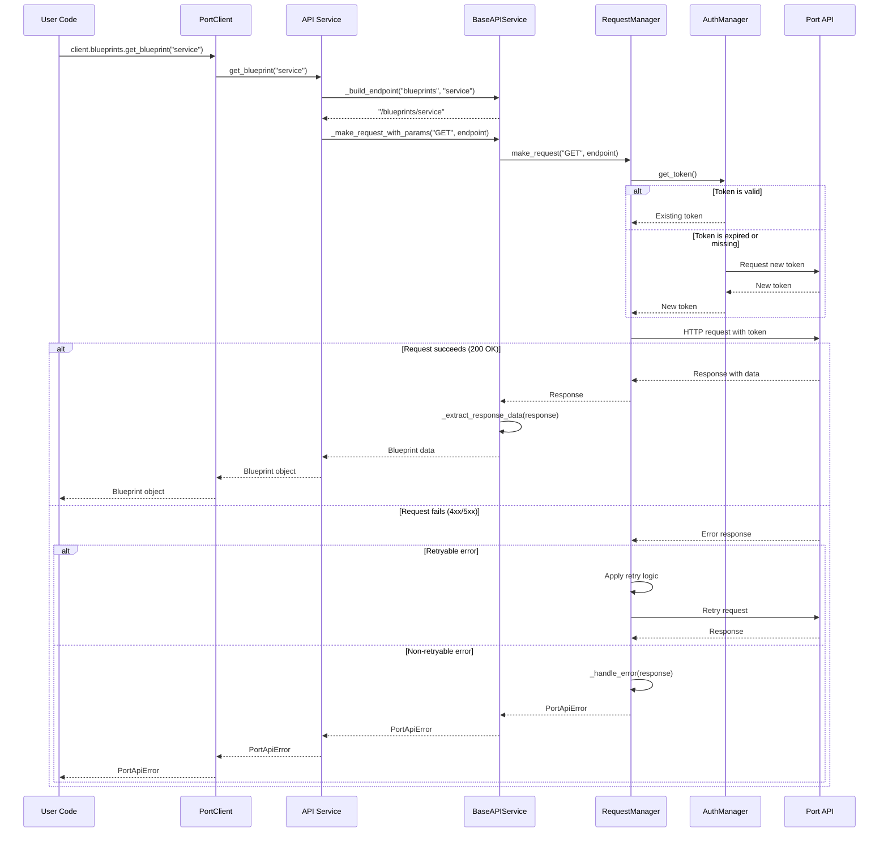

# Request Sequence Diagram

This sequence diagram illustrates the flow of a typical API request in the PyPort library:

1. The user calls a method on a service object (e.g., `client.blueprints.get_blueprint("service")`).
2. The service method builds the endpoint and prepares the request parameters.
3. The base service class handles common functionality and calls the request manager.
4. The request manager ensures a valid authentication token is available.
5. The request manager sends the HTTP request to the API.
6. If the request succeeds, the response is processed and returned to the user.
7. If the request fails, the error is handled according to the retry configuration and error handling logic.

The diagram shows the interaction between the different components of the library and how they work together to handle API requests and responses.
